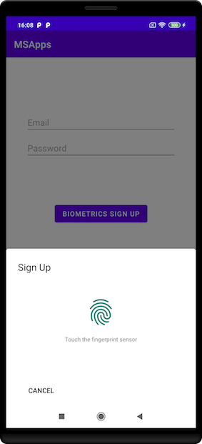

# Kotlin Biometrics Sample

# Installation

#### app build.gradle

    dependencies {
        implementation 'com.msapps.bio:bio:1.0.0'
    }
  
  
#### project  build.gradle

    allprojects {
         repositories {
            ...
             maven { url 'https://dl.bintray.com/msappstdeveloper/android_biometrics_login' }
         }
    }

check if Device Biometrics Enable (Device Got Biometrics Sensor And User Enable this feature)

    if (BiometricsManager.isDeviceBiometricsEnable(this@LoginActivity)) {
            
            
check ability to login (Already Sign IN)
         
    if (BiometricsManager.canLoginWithBiometrics(this@LoginActivity)) {
               
Sign In or Login With Biometrics * optional you can provide password or server token to 
be encrypted - that password will be decrypt for you when you will login next time - via onSuccess callback)

    if (BiometricsManager.canLoginWithBiometrics(this@LoginActivity)) {
        BiometricsManager.showBiometricPromptForDecryption(this@LoginActivity, biometricsCallback)       
     } else {
        BiometricsManager.showBiometricPromptForEncryption(
             this@LoginActivity,
             password.text.toString(),
             biometricsCallback
         )
     }
  
please provide success callback

    private val biometricsCallback = object : BiometricsCallback {
        override fun onSuccess(decryptedText: String) {
            startActivity(Intent(this@LoginActivity, MainActivity::class.java))
        }
    }
    
logout

    BiometricsManager.logout(this@MainActivity)
           